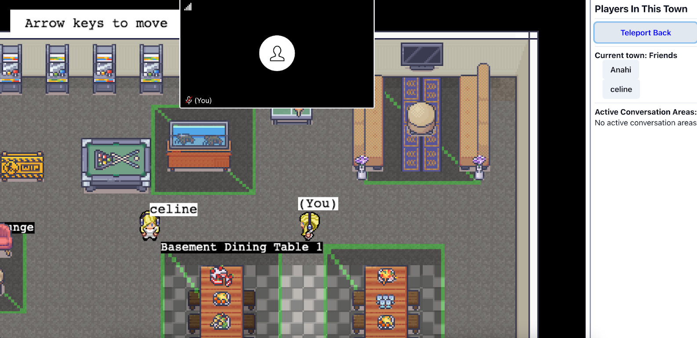

# **Final Report**

_Team 514 4/12/2023_

## Feature Overview and User Manual

### **Build**:

Our demo site is available at: https://spring-23-team-514.netlify.app/.

In order to build and run the code locally, you can download the code at: https://github.com/neu-cs4530/spring-23-team-514, by navigating to the release tag and downloading the zip file. \
Once downloaded and unzipped, configure the backend and frontend by following the process explained in the README.md in the repository, found at:
https://github.com/neu-cs4530/spring-23-team-514#readme

### **Interaction:**

### User Stories Including Tutorial

Teleport A -> B teleports player A to player B’s location: **Essential**

- As a user, I am able to teleport to another player so that I can interact in CoveryTown with that user.

- **Tutorial:** Navigate to the Social Sidebar on the right side of the screen -> Click on any user’s name -> Navigate to the notification on the bottom left corner of your screen -> Click confirm or deny to finalize the teleportation -> On confirm you will send a request to the name clicked, on deny the notification will close and nothing will happen.

Teleport Request: **Essential**

- As a user, when another user wants to teleport to me, I have the choice to either accept or deny their request so that I can control what users I am interacting with.

- **Tutorial:** When another user has already requested to teleport to you -> Navigate to the bottom left corner of your screen -> Click confirm or deny to finalize the teleportation -> On confirm the user will teleport to you, on deny the user will stay where they are.

Teleport Back: **Desirable**

- As a user, when I teleport to another user, I can go back to my original location so that I can continue interacting with my original area and pick up where I left off.

- **Tutorial:** Navigate to the Social Sidebar on the right side of the screen -> Click on the “Teleport Back” Button after having teleported to another player.

### **Screenshot Demo**

Figure 1: From the perspective of user “Anahi”. User “Anahi” has clicked on user “celine” in the Social Sidebar. This has prompted the Teleport Confirm notification on the bottom left corner.

Figure 2: From the perspective of user “celine”. After user “Anahi” confirms their teleportation to user “celine” in Figure 1, user “celine” receives a Teleport Request visible on the bottom left corner.

Figure 3: After user “celine” has accepted the Teleport Request from Figure 2, user “Anahi” gets teleported to user “celine” on the game screen. This completes the Teleportation.

Figure 4: After teleporting, user “Anahi” can click the Teleport Back button and return to the location the user was previously, maintaining the rotation of the sprite. Clicking the button again will return the user to the previously teleported area.

## Technical Overview

Updated class and event diagrams shown here: https://github.com/neu-cs4530/spring-23-team-514/blob/main/docs/architecture.md

### **Backend:**

There were no significant changes made to CoveyTown’s backend codebase for this project.

The only additional data that we had to store for player teleportation was the teleport request state variable in the frontend for triggering notifications and the previous location of the player for teleport back. Teleport back events are dispatched initially from the player who is teleporting, so other players do not need to have access to other players’ previous locations unless that player decides to teleport back themselves.

### **Frontend:**

We added a teleportRequest state variable to CoveyTown’s frontend controller and additional event dispatchers for teleport events so that other frontend components could trigger teleport events.

The teleport request contains the most recent teleport request sent to each player on CoveyTown. We decided not to use a list of requests in order to minimize consensus issues with a list of requests. For example, if player A and player C both sent a teleport request to player B at the same time and player C’s request arrives after player A’s request, player B’s TownController may not include player A’s request. We would also have to delete requests from the list when requests are accepted to make sure that we are not transferring very large lists over requests, which could cause latency. We also used a new structure, TeleportRequest, for the teleport request/accept events so that events would only have to handle one state variable instead of two (one for each player involved in teleport).

The teleport event dispatchers emitTeleport, emitTeleportBack, emitTeleportRequest, and emitTeleportAccept were added to the frontend TownController so that the teleport events could be triggered from components outside of the townController. Our teleport events are triggered from frontend components on CoveyTown’s sidebar GUI and from notification components, so we need to have public dispatchers to execute townController logic.

### **Events:**

- **playerTeleport:** the basic player teleport event. Moves the player who is teleporting first, then forwards the location update to everyone else (like playerMovement event). This way of updating the location minimizes latency for the teleporting player.
- **teleportRequest:** event for when a player sends a teleport request. Forwards the teleport request to all players, and displays a notification to the player who is supposed to receive the request. The teleport request is only stored/updated if the player receives a request meant for them, which appropriately triggers the notification to render.
- **teleportAccept:** event for when a teleport request is accepted. Forwards the accepted request to all players, and triggers the teleport event emitter from the player who is supposed to teleport. We decided to trigger the teleport event emitter because trying to move the player from a different TownController in the teleportAccepted frontend handler causes issues with the player’s interactable ID since it is not updated consistently.

Here is an example of event dispatch and component rendering for player A teleporting to player B:

## Process Overview

### Agile Strategies

- **Git Workflow:** Documented issues for every sprint to assign tasks amongst group members. Utilized Git Workflow to facilitate branch management throughout our sprints. Each issue was used to create an associated branch. Issues were closed once satisfactory pull requests were merged.

- **Sprints:** Divided our workload among four sprints. Each sprint was divided into two sections: implementation and testing. Our first sprint, the 0th sprint, was dedicated to project research and planning.

- **Weekly Retro:** Every Monday, our group would meet to discuss what we accomplished from the first half/end of the sprint. We would use this discussion to readjust tasks for our next sprint if necessary and finish finalizing tasks for the previous sprint.

- **Work Split:** We split the work into two teams: Front end and Back end. We assigned each task to the teams and split tasks within the teams evenly.

### **Sprint 0**

PLANNED MILESTONE:

- Confirm what front end components and back end events/data are necessary for implementation.
- Make note of existing components that can be reused.
- Create the first draft of the design.
- Establish a mutual codebase/development environment for the project.

ACTUAL COMPLETED:

- Everything planned for this sprint was completed within the sprint.

### **Sprint 1**

PLANNED MILESTONE:

- Backend: Teleport event added to server, Teleport event listener added to player.
- Frontend: Click on name leads to teleport, Notification component abstracted for teleport confirm and request (design)

ACTUAL COMPLETED:

- Frontend and back end components were successfully completed. A bug in the implementation that prevented teleportation from appearing on the user who requested the teleports page was moved to being fixed during Sprint 2.

### **Sprint 2**

PLANNED MILESTONE:

- Backend: Teleport request event added to server and listener added to player. Teleport. Player model has access to previous location data. Teleport back event and
  listener added.
- Frontend: Implement notification components for teleport confirm and teleport request. Add a component for teleport back that the user can minimize. Teleport back component should be visible after a user teleports.

ACTUAL COMPLETED:

- Minor issue with teleport request functionality, have to fix in Sprint 3. Front end goals for Teleport Back will bleed onto Sprint 3. Backend goals met for Teleport Back and Teleport Confirm.

### **Sprint 3**

PLANNED MILESTONE:

- Project is finished and well tested. Essential acceptance criteria have been met, documentation is complete. Demonstration and presentation are ready for class.

ACTUAL COMPLETED:

- Able to fix the bug with teleport request toasts from previous sprint. Everything planned for this sprint has been successfully completed up to this point.

Final Summary: In the end, none of our setbacks led to any changes in project scope. We were able to complete all of the expected features by the final deadline.
